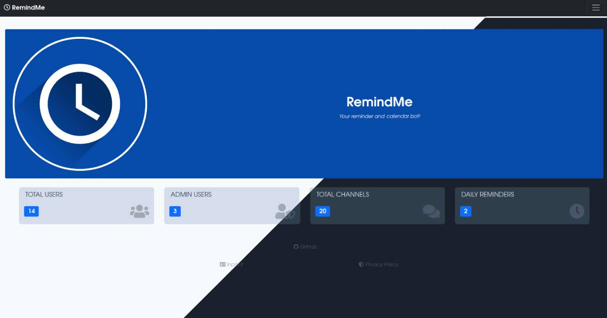

# RemindMe-Web

Web application to control and manage a RemindMe instance.

* Dark and light mode (depending on the operating systems settings)
* Mobile optimized
* Stateless (no database, no sessions)
* Simple and reliable basic authentication

## ⌨️ Usage

Open the domain where your RemindMe-Web instance is located. 

The page will ask you for credentials (HTTP Basic Auth). Enter any username and the apikey defined for your RemindMe instance.

## ⚙️ Installation

In any case you need a valid configuration, copy the `.env.example`, rename it to `.env` and fill it.

### Docker

Coming soon. You have a working configuration? We are thankful for any help!

### Plain

1. Setup a webserver (nginx and apache should work) with PHP >= 8.0.2, for additional requirements check the [official laravel documentation](https://laravel.com/docs/8.x/deployment)
2. Install composer
3. Inside the remindme-web folder run `composer install` to install all dependencies
4. Copy the files inside remindme-web to your webserver
5. Direct all requests to the `public/index.html` as default

## 👩‍🔧 Contribute

I really enjoy help in making this project even better. So we all can enjoy the work on this project please follow the rules. 

You can contribute in many ways to this project:

* Report issues and improvement ideas
* Test new features
* Improve the code basis (open a pull request)
* Add new features (open a pull request)

### Issues, ideas and more

Please submit your issues or specific feature requests as "Issues". 

General ideas and concepts can be discussed in the "Discussions" section.

### Contributing code

Fork this repository and add your changes. Open a pull request to merge them in the main branch of this repository.

## ❤️ Attribution 

Build with:

* [Laravel](https://laravel.com/)
* [Bootstrap](https://getbootstrap.com)
* [Normalize](https://normalize.css)
* [Fontawesome](https://fontawesome.com)